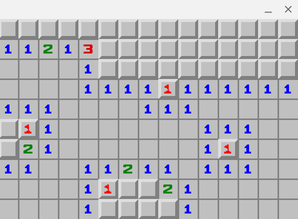

# minesweeper
## Minesweeper game using Pygame

Simple minesweeper implementation using pygame. You can control the size of the mine field, and the difficulty, by using command line arguments.



## Game Commands
When running the game, the following keyboard/mouse commands are available:
- left-click - Uncover the selected cell
- right-click - Set/Unset the flag
- r / R - Restart the game. Resets the minefield.
- ESC / q / Q - Quit the game

## Usage
```
$ python ./minesweeper.py --help
usage: minesweeper.py [-h] [-W [WIDTH]] [-H [HEIGHT]] [-D [DIFFICULTY]]

Minesweeper

optional arguments:
  -h, --help            show this help message and exit
  -W [WIDTH], --width [WIDTH]
                        Width of minefield
                        (default: 15)
  -H [HEIGHT], --height [HEIGHT]
                        Height of minefield
                        (default: 10)
  -D [DIFFICULTY], --difficulty [DIFFICULTY]
                        Difficulty, measured as a percentage of total cells that have a bomb.
                        A value of 0.15 means 15% of the cells will have a bomb.
                        (default: 0.100000)
```
